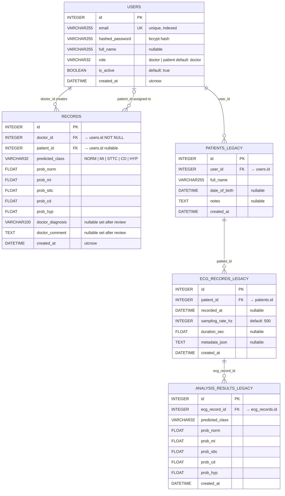

# ER Diagram — ECG Analysis System

> **Active tables** (`users`, `records`) are fully wired to the API.  
> Legacy tables (`patients`, `ecg_records`, `analysis_results`) exist in the ORM but are not used by any endpoint.

