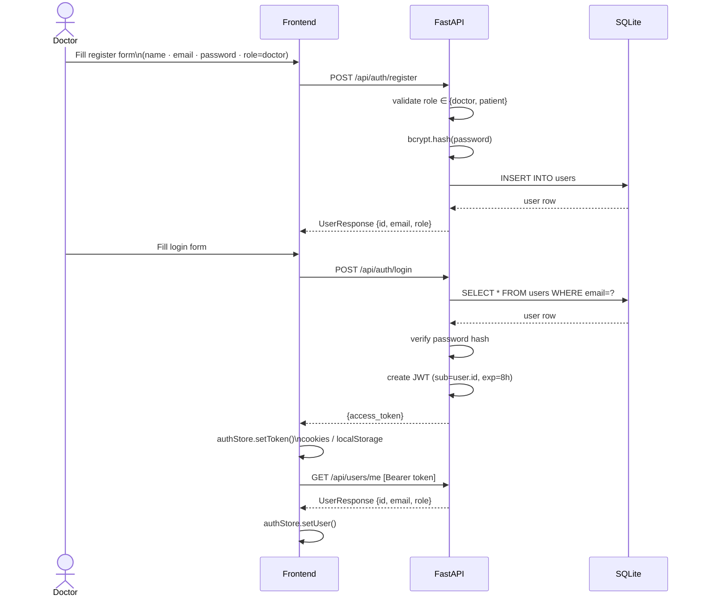
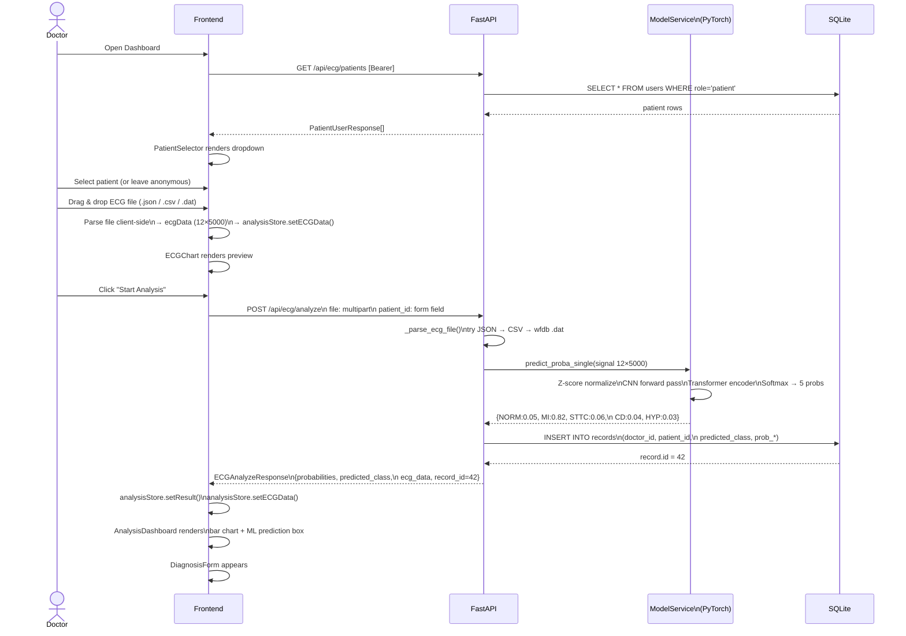
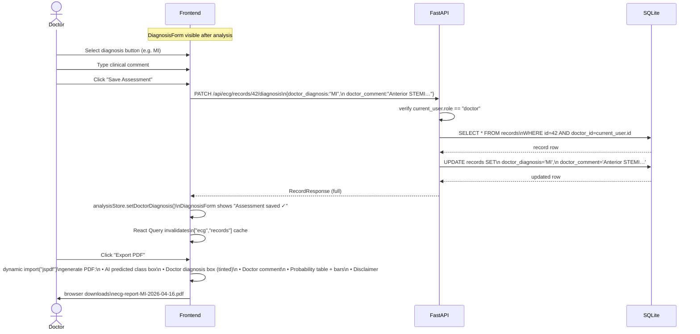
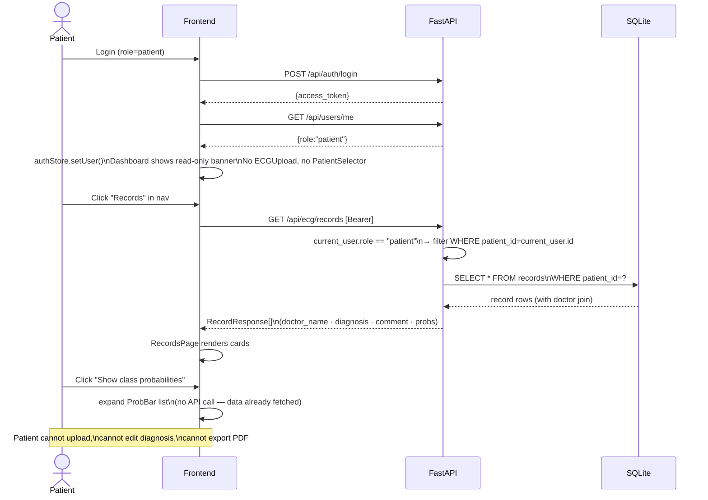

# Sequence Diagrams — ECG Analysis System

---

## 1. Doctor — Registration & Login

---

## 2. Doctor — ECG Upload & ML Analysis

---

## 3. Doctor — Save Clinical Assessment

---

## 4. Patient — View Records

